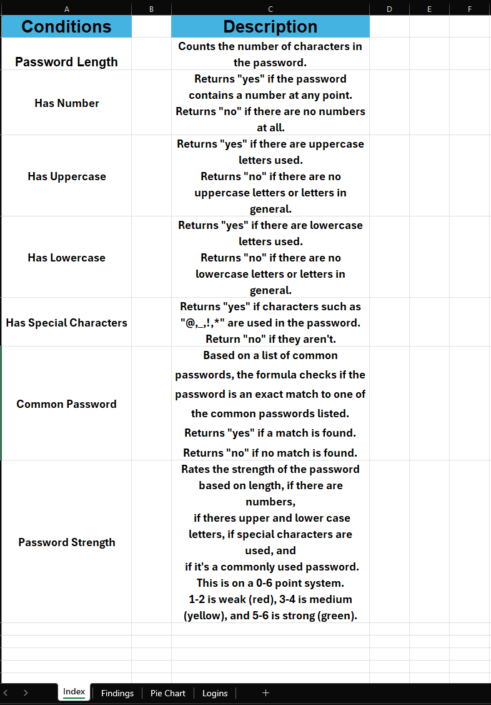
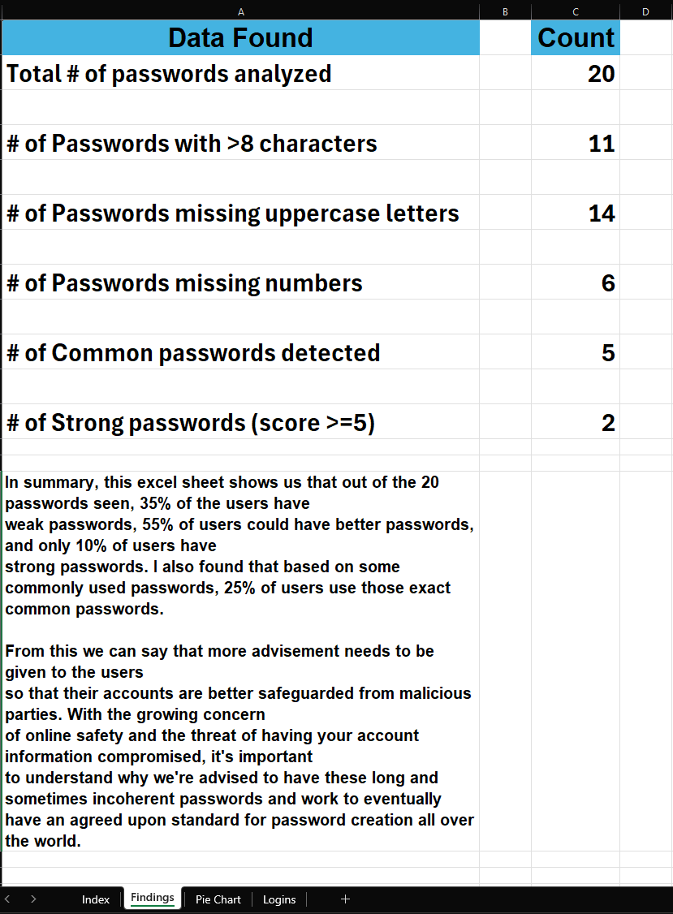
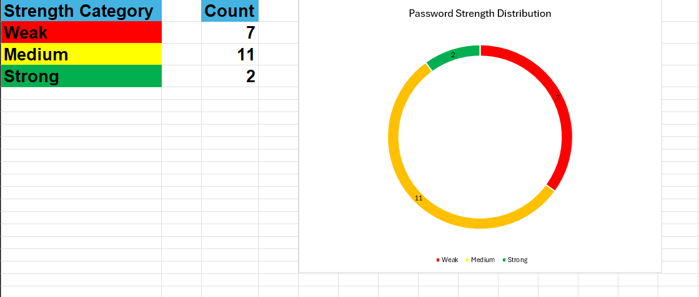
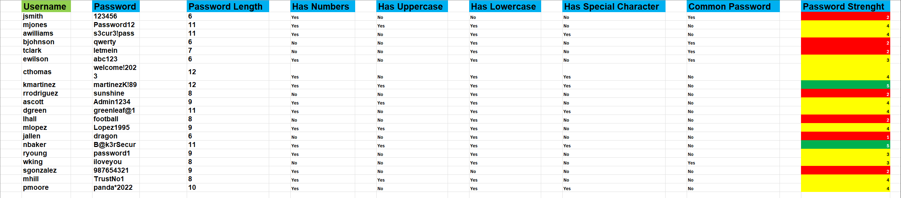

# Password-Audit-Tracker

## I created a password auditing tracker using **Microsoft Excel** to further my learning in both Excel and **Auditing/Cybersecurity** practices.

As mentioned in the short introduction, the goal of this project was to gain a stronger understanding of Excel's functions and how they can be used to
present information to viewers. Given my interest in the field of cybersecurity, I felt as though this would be a great starting point in familiarizing
myself with what a Security Auditor may have to go through.

With the help of numerous resources online, I created an Excel file with different sample usernames and passwords to analyze and critique. Not only does 
this emulates assignments that people in security roles may have to do, but it also allows me to reinforce some of the teachings I've learned throughout
my academic journey regarding account safeguarding.

In the Excel file itself, there are 4 sheets containing separate pieces of information. They are: Index, Findings, Pie Chart, and Logins. 

<ins>**Index:**</ins>

This sheet describes what criteria I'm looking for in the User's password. Using Excel functions like IFs, COUNT, and SUMPRODUCT, I narrowed a majority of the 
responses to a simple "Yes" or "No". I also mention my usage of Conditional Formatting within the "Password Strength" criteria, where I'm using color coordination
to indicate the strength of the user's password. Red is weak and green is strong.

<ins>**Findings:**</ins>

This sheet includes a few data points along with a comprehensive summary discussing the percentage of users with passwords ranging from weak to strong and whether
their passwords were among the most common in the world. I also discuss the topic of why having a strong password is important and bring up the claim that
a standard for password creation should be formed to protect users from around the world.

<ins>**Pie Chart:**</ins>

This sheet mainly revolved around the "Password Strength" criteria and worked to analyze the overall number of users that were on the scale of weak to strong.
I chose a pie chart as my graph so viewers could have an easier understanding of the number of people that fit into each category and see the imbalance between
having a "medium strength" password compared to those that have "very strong" passwords.

<ins>**Logins:**</ins>

This sheet shows the process I used to gather all of this data. I separated the criteria but column and used Excel's functions to assist me in creating an easy-to-follow Audit tracker. The criteria that I analyzed the user's passwords on were their password's length, if it had numbers in it, if it contained upper and
lower case letters, if it had any special characters, if it directly matched a range containing commonly used passwords, and giving their passwords a grade
from a scale of 0-6. With 0 being a weak password and 6 being a strong password. As mentioned previously, I also implemented color coordination so that viewers
have an easier time understanding which passwords can be seen as weak or strong.

Overall, I enjoyed my time working on this project and feel a boost in confidence regarding my ability to accurately analyze aspects of a user's account information
and use Excel to present those findings in a digestible manner. Thank you for viewing.
